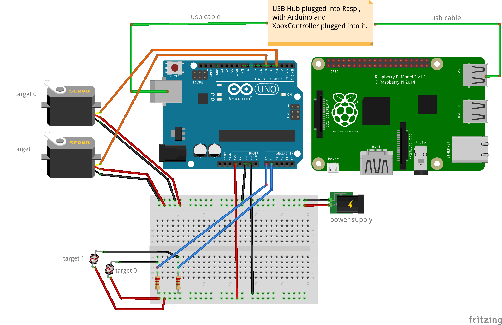

# Arduino-Laser-Game
A laser pointer shooting game with an Arduino and optional Raspberry Pi.

The rough idea is the photoresistors(light sensors) are your targets and you shoot them with your laser pointer.
When you hit them they will fall down. A second player can pop-up targets using an Xbox360 controller wired up to the raspi.

## Equipment

- Arduino Uno
- Breadboard
- 4x Servos
- 4x Photoresistors (light sensors)
- 4x resistors
- power supply or wall plug to power the servos
- wires
- laser pointer or other directed light source
- Raspberry Pi B+ (optional)
- Xbox wired controller (optional)
- USB hub (optional)

## Schema (for first two targets)

## Setup

1. Wire up pieces as shown in the shematic.
2. The Arduino and Raspi are connected via usb so they can send/receive serial commands between eachother.
3. Attach the photoresistors to the servos (We put ours on the end of forks for better range of motion).
4. Put the code from the raspi folder of this repo onto your Raspberry Pi.
5. Install the xboxdrv driver onto your raspi, and pygame if you don't already have it.
6. Put the code from the arduino folder onto your arduino.
7. The Arduino code may require some calabration based on your servo angles and photoresistore sensitivity.

The optional parts are so a second player can control the targets/servos by an Xbox controller plugged into the Raspi.
If you don't have the optional components you can modify the Arduino code to just pop-up targets at random intervals.
